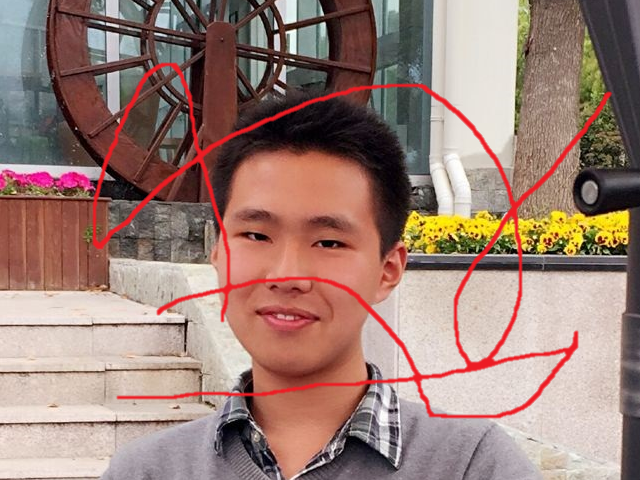
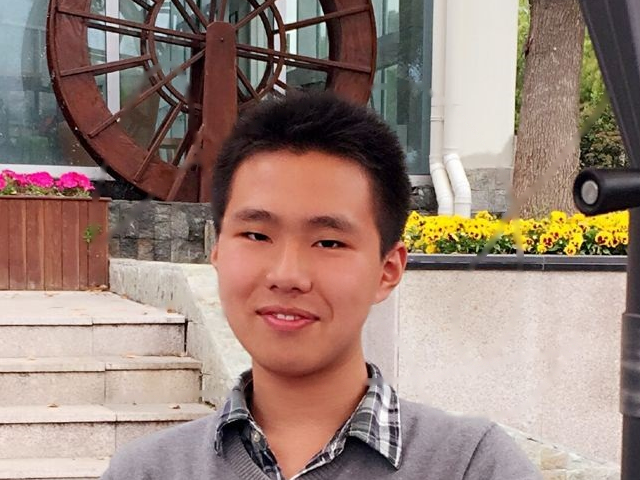
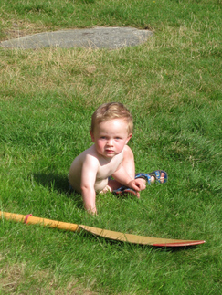
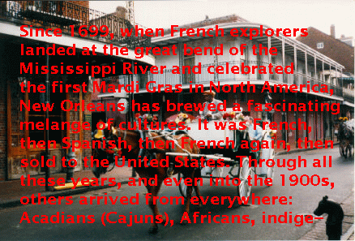

# Image Inpainting Software


### Introduction
This is an open source software for image inpainting, which is composed
by two different algorithm: exemplar-based algorithm and Markov random
field.


### Installation
#### Linux(Ubuntu/Debian)
For exemplar-based algorithm:
```
$ sudo pip install numpy
$ sudo pip install scipy
$ sudo apt-get install python-pil.imagetk python-skimage
```
#### Windows
For Markov random field: MATLAB 2014+


### File Structure
- README.md: this file
- dataset: Berkeley image inpainting dataset (300 images) and some test images 
- Exemplar_Based_Algorithm: source code for exemplar-based
- Markov_Random_Field: source code for MRF


### Examples
* Image detail restoration  

  
  
  
* Image object removal  



* Image text removal  

  

### Contribute
If you want to contribute to this project, please fork
this project and pull request or give issues.


### License
This is an open source project and license is MIT license, refer to
LICENSE file for details.

